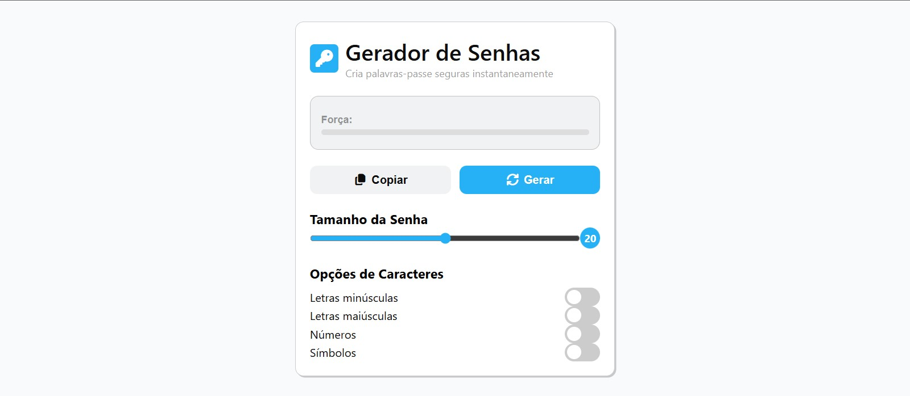

# 🔑 Password Generator

Um **gerador de senhas moderno e interativo**, desenvolvido para criar **palavras-passe seguras e personalizáveis** de forma rápida e prática.  
O projeto inclui uma interface intuitiva e uma barra dinâmica que indica a força da senha em tempo real.

---

## ⚙️ Funcionalidades

- 🔒 **Geração de senhas seguras** com base em diferentes tipos de caracteres:
  - Letras minúsculas  
  - Letras maiúsculas  
  - Números  
  - Símbolos  

- 🎚️ **Controle de comprimento da senha** através de um *slider* (mínimo de 10 e máximo de 30 caracteres)  
- 💪 **Indicador visual de força da senha** (fraca, média ou forte)  
- 📋 **Função de cópia** direta para a área de transferência  
- ⚡ **Notificações tipo “toast”** ao copiar ou em caso de erro  
- 💡 Design moderno, responsivo e fácil de usar  

---

## 🛠️ Tecnologias utilizadas

- **HTML5** → estrutura semântica e acessível  
- **CSS3** → estilização moderna e responsiva  
- **TypeScript** → lógica de geração e manipulação de elementos  
- **Font Awesome** → ícones visuais  

---

## 🚀 Como usar

O projeto está **deployado na Vercel** e pode ser usado diretamente pelo navegador:  

[🔗 Abrir Password Generator](https://seu-projeto.vercel.app)

1. Seleciona os tipos de caracteres e o tamanho desejado.  
2. Clica em **Generate** para criar uma nova senha.  
3. Usa o botão **Copy** para copiar rapidamente a senha gerada.

---

## 🧠 Conceito

O objetivo deste projeto é demonstrar a criação de uma ferramenta simples, útil e visualmente agradável, que mostra na prática o uso de **TypeScript** para manipular o DOM, **componentes visuais reativos**, e a **validação de segurança básica** de senhas.

---

## 📸 Preview


> Exemplo:
> ```markdown
> 
> ```

---

## 🧑‍💻 Autor

**Carlos Lukeni**  
📍 Angola  
💼 Desenvolvedor Web
📧 [carloslukeni110@gmail.com](mailto:carloslukeni110@gmail.com)
